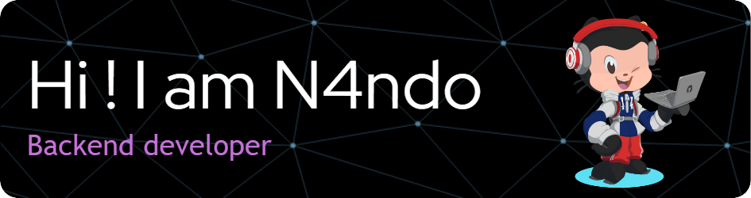

###

My name is Fernando and I'm a software engineering student from Mexico 

###

<h2 align="left">About me</h2>

###

✨ Creating bugs since 2016 📚 I'm currently learning softwere architectures and backend development 🎯 I’m looking to collaborate on open source projects

###

<h2 align="left">💻 Tech Stack:</h2>

###

  
  
  
  
  
  
  
<!--   
   -->
  
  
  
  
  
  
  
  
  
   
  
   
  
<!--     -->
<!--    -->
  
  
  
  
  

###

<h2 align="left">🔥 My Stats </h2>

###

  
  

###
###

 <strong> "Sometimes it is the people no one can imagine anything of who do the things no one can imagine" - Alan Turing </strong> 

###

